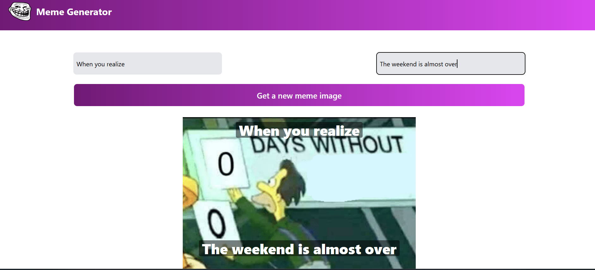

# Meme Generator App

This is a simple Meme Generator application built using React and styled with Tailwind CSS. The app allows users to generate random memes or upload their own images to create custom memes. It's a fun way to explore React with a focus on dynamic content and styling.



## Features

- Generate random memes from a collection of pre-defined images and captions.
- Customize text placement, size, and styling on memes.

## Tech Stack

- **Frontend**: React.js
- **CSS Framework**: Tailwind CSS

## Installation

To get started with the project locally, follow the steps below:

1. Clone this repository to your local machine:
   ```bash
   git clone https://github.com/your-username/meme-generator.git
2. Navigate into the project directory:
   ```bash
      cd meme-generator
3. Install dependencies:
 ```bash
      npm install
      npm start

 
      
